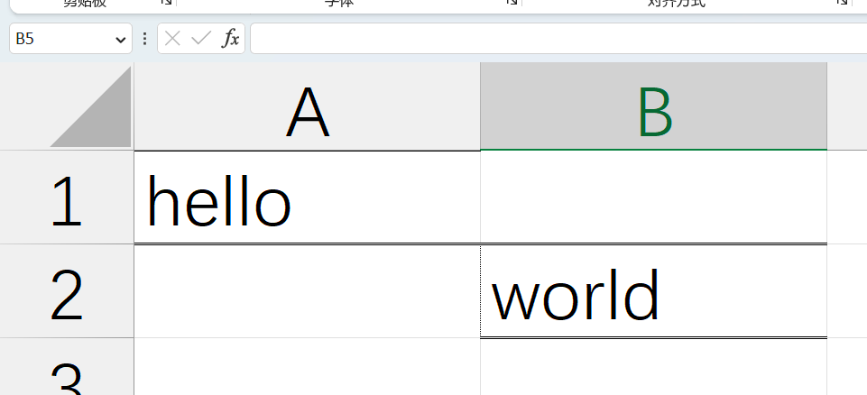
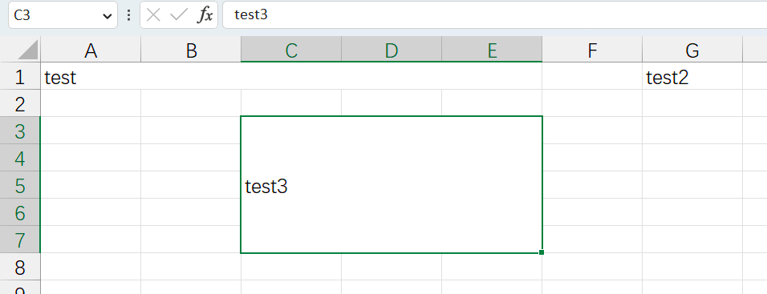
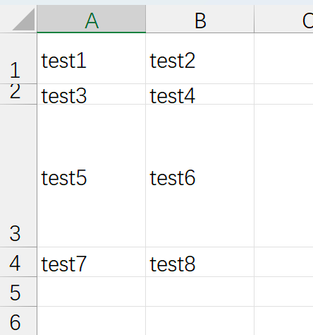
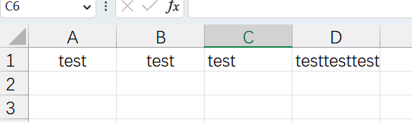
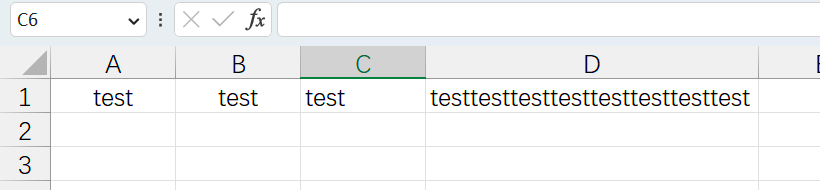
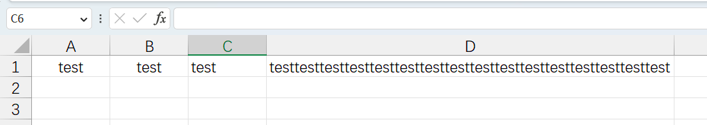
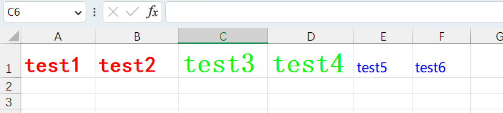

### 格式设置

#### 框线

```java
package mao;

import org.apache.poi.hssf.usermodel.HSSFCellStyle;
import org.apache.poi.ss.usermodel.*;
import org.apache.poi.xssf.usermodel.XSSFWorkbook;

import java.io.FileOutputStream;

/**
 * Project name(项目名称)：java报表_POI格式设置
 * Package(包名): mao
 * Class(类名): Test1
 * Author(作者）: mao
 * Author QQ：1296193245
 * GitHub：https://github.com/maomao124/
 * Date(创建日期)： 2023/6/2
 * Time(创建时间)： 22:12
 * Version(版本): 1.0
 * Description(描述)： 无
 */

public class Test1
{
    public static void main(String[] args)
    {
        Workbook workbook = new XSSFWorkbook();
        CellStyle cellStyle = workbook.createCellStyle();
        cellStyle.setBorderBottom(BorderStyle.DOUBLE);//底线
        cellStyle.setBorderTop(BorderStyle.DOUBLE);//顶部线
        cellStyle.setBorderLeft(BorderStyle.HAIR);//左侧线
        cellStyle.setBorderRight(BorderStyle.NONE);//右侧线
        Sheet sheet = workbook.createSheet("test");
        Row row = sheet.createRow(0);
        Cell cell = row.createCell(0);
        cell.setCellValue("hello");
        cell.setCellStyle(cellStyle);
        row = sheet.createRow(1);
        cell = row.createCell(1);
        cell.setCellValue("world");
        cell.setCellStyle(cellStyle);
        try (FileOutputStream fileOutputStream = new FileOutputStream("./out.xlsx"))
        {
            workbook.write(fileOutputStream);
            workbook.close();
        }
        catch (Exception e)
        {
            e.printStackTrace();
        }
    }
}
```





#### 合并单元格

```java
package mao;

import org.apache.poi.ss.usermodel.Cell;
import org.apache.poi.ss.usermodel.Row;
import org.apache.poi.ss.usermodel.Sheet;
import org.apache.poi.ss.usermodel.Workbook;
import org.apache.poi.ss.util.CellRangeAddress;
import org.apache.poi.xssf.usermodel.XSSFWorkbook;

import java.io.FileOutputStream;

/**
 * Project name(项目名称)：java报表_POI格式设置
 * Package(包名): mao
 * Class(类名): Test2
 * Author(作者）: mao
 * Author QQ：1296193245
 * GitHub：https://github.com/maomao124/
 * Date(创建日期)： 2023/6/3
 * Time(创建时间)： 12:31
 * Version(版本): 1.0
 * Description(描述)： 无
 */

public class Test2
{
    public static void main(String[] args)
    {
        Workbook workbook = new XSSFWorkbook();
        Sheet sheet = workbook.createSheet("test");
        //合并单元格，参数为 起始行, 结束行, 起始列, 结束列    
        sheet.addMergedRegion(new CellRangeAddress(0, 0, 0, 4));
        Row row = sheet.createRow(0);
        Cell cell = row.createCell(0);
        cell.setCellValue("test");
        cell = row.createCell(6);
        cell.setCellValue("test2");
        sheet.addMergedRegion(new CellRangeAddress(2, 6, 2, 4));
        row = sheet.createRow(2);
        cell = row.createCell(2);
        cell.setCellValue("test3");
        try (FileOutputStream fileOutputStream = new FileOutputStream("./out2.xlsx"))
        {
            workbook.write(fileOutputStream);
            workbook.close();
        }
        catch (Exception e)
        {
            e.printStackTrace();
        }
    }
}
```





#### 行高

```java
package mao;

import org.apache.poi.ss.usermodel.Cell;
import org.apache.poi.ss.usermodel.Row;
import org.apache.poi.ss.usermodel.Sheet;
import org.apache.poi.ss.usermodel.Workbook;
import org.apache.poi.ss.util.CellRangeAddress;
import org.apache.poi.xssf.usermodel.XSSFWorkbook;

import java.io.FileOutputStream;

/**
 * Project name(项目名称)：java报表_POI格式设置
 * Package(包名): mao
 * Class(类名): Test3
 * Author(作者）: mao
 * Author QQ：1296193245
 * GitHub：https://github.com/maomao124/
 * Date(创建日期)： 2023/6/3
 * Time(创建时间)： 12:49
 * Version(版本): 1.0
 * Description(描述)： 无
 */

public class Test3
{
    public static void main(String[] args)
    {
        Workbook workbook = new XSSFWorkbook();
        Sheet sheet = workbook.createSheet("test");

        Row row = sheet.createRow(0);
        row.createCell(0).setCellValue("test1");
        row.createCell(1).setCellValue("test2");
        //设置行高
        row.setHeight((short) 500);
        row = sheet.createRow(1);
        row.createCell(0).setCellValue("test3");
        row.createCell(1).setCellValue("test4");
        //设置行高
        row.setHeight((short) 200);
        row = sheet.createRow(2);
        row.createCell(0).setCellValue("test5");
        row.createCell(1).setCellValue("test6");
        //设置行高
        row.setHeight((short) 1400);
        row = sheet.createRow(3);
        row.createCell(0).setCellValue("test7");
        row.createCell(1).setCellValue("test8");


        try (FileOutputStream fileOutputStream = new FileOutputStream("./out3.xlsx"))
        {
            workbook.write(fileOutputStream);
            workbook.close();
        }
        catch (Exception e)
        {
            e.printStackTrace();
        }
    }
}
```





#### 表格的对齐方式

```java
package mao;

import org.apache.poi.hssf.usermodel.HSSFCellStyle;
import org.apache.poi.ss.usermodel.*;
import org.apache.poi.xssf.usermodel.XSSFWorkbook;

import java.io.FileOutputStream;

/**
 * Project name(项目名称)：java报表_POI格式设置
 * Package(包名): mao
 * Class(类名): Test4
 * Author(作者）: mao
 * Author QQ：1296193245
 * GitHub：https://github.com/maomao124/
 * Date(创建日期)： 2023/6/3
 * Time(创建时间)： 12:55
 * Version(版本): 1.0
 * Description(描述)： 无
 */

public class Test4
{
    public static void main(String[] args)
    {
        Workbook workbook = new XSSFWorkbook();
        Sheet sheet = workbook.createSheet("test");
        CellStyle cellStyle = workbook.createCellStyle();
        //水平居中
        cellStyle.setAlignment(HorizontalAlignment.CENTER);
        //垂直居中
        cellStyle.setVerticalAlignment(VerticalAlignment.CENTER);

        Row row = sheet.createRow(0);
        Cell cell = row.createCell(0);
        cell.setCellValue("test");
        //居中对齐
        cell.setCellStyle(cellStyle);
        cell = row.createCell(1);
        cell.setCellValue("test");
        //居中对齐
        cell.setCellStyle(cellStyle);

        cell = row.createCell(2);
        cell.setCellValue("test");
        //默认
        //cell.setCellStyle(cellStyle);

        cellStyle = workbook.createCellStyle();
        //循环填充
        cellStyle.setAlignment(HorizontalAlignment.FILL);
        //垂直居中
        cellStyle.setVerticalAlignment(VerticalAlignment.CENTER);

        cell = row.createCell(3);
        cell.setCellValue("test");
        //循环填充
        cell.setCellStyle(cellStyle);

        try (FileOutputStream fileOutputStream = new FileOutputStream("./out4.xlsx"))
        {
            workbook.write(fileOutputStream);
            workbook.close();
        }
        catch (Exception e)
        {
            e.printStackTrace();
        }
    }
}
```











#### 字体

```java
package mao;

import org.apache.poi.ss.usermodel.*;
import org.apache.poi.xssf.usermodel.XSSFWorkbook;

import java.io.FileOutputStream;

/**
 * Project name(项目名称)：java报表_POI格式设置
 * Package(包名): mao
 * Class(类名): Test5
 * Author(作者）: mao
 * Author QQ：1296193245
 * GitHub：https://github.com/maomao124/
 * Date(创建日期)： 2023/6/3
 * Time(创建时间)： 13:06
 * Version(版本): 1.0
 * Description(描述)： 无
 */

public class Test5
{
    public static void main(String[] args)
    {
        Workbook workbook = new XSSFWorkbook();
        Sheet sheet = workbook.createSheet("test");
        Font font = workbook.createFont();
        //加粗
        font.setBold(true);
        //字体名称
        font.setFontName("黑体");
        //字体颜色
        font.setColor(Font.COLOR_RED);
        //字体大小
        font.setFontHeightInPoints((short) 20);
        CellStyle cellStyle = workbook.createCellStyle();
        cellStyle.setFont(font);

        Row row = sheet.createRow(0);
        Cell cell = row.createCell(0);
        cell.setCellValue("test1");
        cell.setCellStyle(cellStyle);

        cell = row.createCell(1);
        cell.setCellValue("test2");
        cell.setCellStyle(cellStyle);

        font = workbook.createFont();
        //加粗
        font.setBold(true);
        //字体名称
        font.setFontName("宋体");
        //字体颜色
        font.setColor((short) 11);
        //字体大小
        font.setFontHeightInPoints((short) 25);
        cellStyle = workbook.createCellStyle();
        cellStyle.setFont(font);

        cell = row.createCell(2);
        cell.setCellValue("test3");
        cell.setCellStyle(cellStyle);

        cell = row.createCell(3);
        cell.setCellValue("test4");
        cell.setCellStyle(cellStyle);

        font = workbook.createFont();
        //加粗
        font.setBold(false);
        //字体名称
        font.setFontName("微软雅黑");
        //字体颜色
        font.setColor((short) 12);
        //字体大小
        font.setFontHeightInPoints((short) 12);
        cellStyle = workbook.createCellStyle();
        cellStyle.setFont(font);

        cell = row.createCell(4);
        cell.setCellValue("test5");
        cell.setCellStyle(cellStyle);

        cell = row.createCell(5);
        cell.setCellValue("test6");
        cell.setCellStyle(cellStyle);

        try (FileOutputStream fileOutputStream = new FileOutputStream("./out5.xlsx"))
        {
            workbook.write(fileOutputStream);
            workbook.close();
        }
        catch (Exception e)
        {
            e.printStackTrace();
        }
    }
}
```





